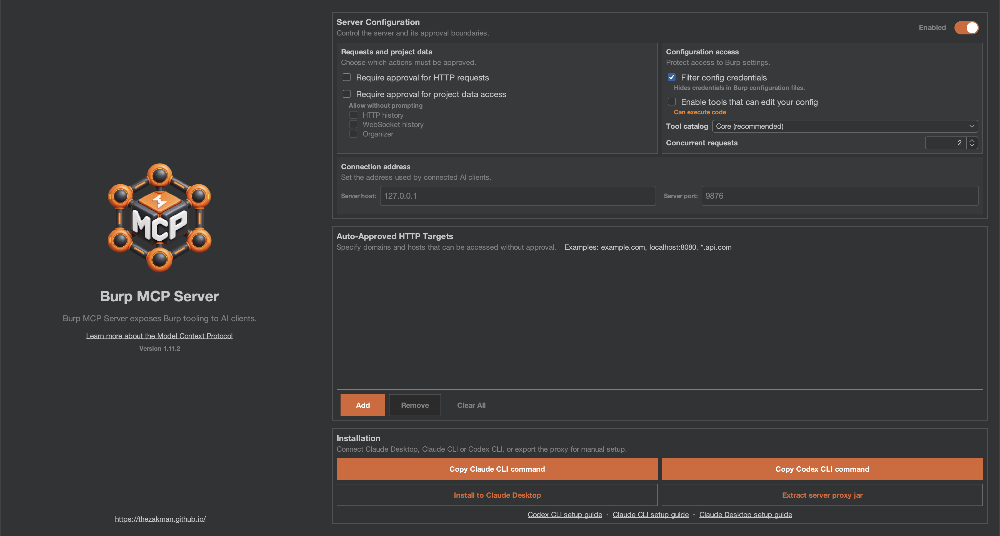
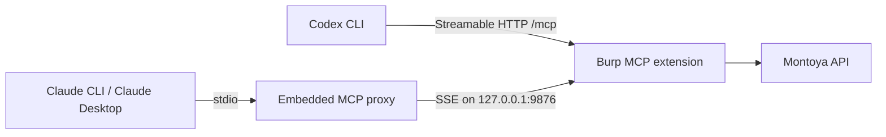

<p align="center">
  
</p>

<h1 align="center">Smart Burp MCP Server</h1>

<p align="center">
  <strong>Extension 1.12.1</strong> &nbsp;·&nbsp;
  <strong>Montoya API 2026.7 — latest official release</strong>
</p>

## Overview

Connect Burp Suite to Codex CLI, Claude CLI, Claude Desktop and other MCP clients. This fork extends PortSwigger's
MCP server with compact evidence indexes, native Burp IDs, Repeater/Intruder capture, Organizer workflows,
response comparison, diagnostics and reviewed single-request mutations.

<p align="center">
  
</p>

<p align="center"><sub>Compact, responsive controls for approvals, tool profiles, concurrency, target allowlists and client installation.</sub></p>

The extension is built against
[Montoya API 2026.7](https://github.com/PortSwigger/burp-extensions-montoya-api/releases/tag/2026.7), the latest
official Montoya release published by PortSwigger. The Montoya version and the extension version are independent:
Montoya identifies the Burp API compatibility level, while `1.12.1` identifies this Smart Burp MCP release.

For more information about the protocol visit: [modelcontextprotocol.io](https://modelcontextprotocol.io/)

## How this fork differs from the original

This project started from PortSwigger's official
[`mcp-server`](https://github.com/PortSwigger/mcp-server) at commit
[`642e6fa`](https://github.com/PortSwigger/mcp-server/commit/642e6fa). The comparison below describes that
fork point; the upstream project may continue to evolve independently.

| Area | PortSwigger original at the fork point | Smart Burp MCP Server |
| --- | --- | --- |
| Client setup | Claude Desktop installer and manual stdio proxy extraction | Keeps both, adds shell-safe **Claude CLI**, and connects **Codex CLI directly over Streamable HTTP** without launching the proxy |
| Proxy history | Full request/response pagination and basic regex search | Adds compact summaries, native Burp IDs, highlight colors, timing, MIME/size metadata, host/path/status/header/Trace ID/JSON filters, bounded regex work and stable keyset pagination |
| Message detail | Bulk entries with a fixed output limit | Fetches selected HTTP and WebSocket messages by native ID with Unicode-safe chunks and explicit continuation offsets |
| Sensitive traffic | Captured messages returned by the original bulk tools | Keeps raw cookies, tokens and credentials intact by default; optional masking is explicit and tool-specific |
| Site Map | No compact Site Map MCP workflow | Adds filtered compact indexing and content-derived SHA-256 keys with selective detail retrieval |
| Organizer | Bulk read and regex search | Adds compact index/detail, native IDs, notes, highlight updates and saving existing captured exchanges with note and color without target traffic; Organizer Collections remain unavailable because Montoya does not expose their names or membership |
| Repeater and Intruder | Can create tabs from supplied MCP content | Also lists live Repeater titles, groups, detached windows and session IDs; observes current editor-bound request/response states; opens exact Proxy-history requests by ID; and captures subsequent Repeater/Intruder exchanges with explicit attribution confidence |
| Response analysis | Caller compares raw results manually | Adds read-only pairwise comparison plus anonymous vs invalid-token vs valid-token control comparison |
| Request changes | Caller constructs and sends a complete request | Adds previewed single-request mutation for method, path, header, body and common parameter types; send requires the preview SHA-256 and target approval |
| MCP guidance | Tool descriptions only | Adds server initialize instructions that direct clients to compact index → selected detail workflows |
| Tool catalog cost | Exposes the complete tool set to every client | Adds **Read-only investigation**, compact **Core** and **Full compatibility** profiles; history summary, regex search and exchange retrieval are available in Core |
| Tool contracts | Basic parameter types | Adds field descriptions, enums, bounds, examples, MCP behavior annotations, numeric compatibility and structured errors |
| Collaborator | Payload generation and interaction polling | Correlates payload, originating MCP/Repeater/Intruder exchange, received interaction and Trace ID in one result |
| Diagnostics | Server startup state and generic errors | Adds nested startup diagnostics, runtime/JVM/proxy status, catalog/schema size, per-tool timing/output metrics, history-index and Collaborator-correlation metrics, plus a metadata-only action log |
| MCP transport | Local SSE endpoint consumed through the packaged stdio proxy | Keeps SSE/stdio compatibility and adds a native Streamable HTTP endpoint at `/mcp` |
| Packaging | Embeds the proxy by updating the completed archive with an external `jar` command | Declares the proxy as a Gradle archive input and always emits `build/libs/burp-mcp-all.jar` |
| UI | Uses the Swing/Burp list colors directly | Keeps Burp theming and derives restrained alternating rows that remain readable in dark and light modes |
| Regression coverage | Original unit and MCP integration tests | Retains the original suite and adds Claude CLI, Codex, triage, filtering, handoff, diagnostics and mutation regressions |

### Compatibility retained

- Original HTTP/1.1, HTTP/2, Repeater, Intruder, configuration, editor and utility tools remain available in the
  **Full compatibility** profile.
- Scanner and Collaborator tools remain conditional on Burp Suite Professional.
- The default local endpoint remains `127.0.0.1:9876`; the embedded proxy still bridges stdio clients to SSE and
  Streamable HTTP clients can connect directly to `http://127.0.0.1:9876/mcp`.
- Existing bulk Proxy and Organizer tools remain for clients that already depend on them. Their compact replacements
  are preferred for new workflows because they avoid loading unrelated bodies into the MCP context.
- The original project-data and per-target approval controls remain in force.

### Design direction

The fork focuses on evidence traceability and controlled interaction: discover through compact indexes, retain native
IDs, retrieve only the messages needed, compare captured evidence locally, preview changes, and send one reviewed
request at a time. It deliberately does not include an automatic payload batch, retry loop or offensive agent prompt.

## Features

- Native Codex CLI setup command using direct Streamable HTTP
- Native Claude CLI setup command stored at user scope
- Claude Desktop installer and embedded stdio-to-SSE proxy
- Compact Proxy, Site Map, Organizer, Repeater and Intruder indexes
- Native Burp IDs and content-derived Site Map keys for traceable evidence retrieval
- Bounded request/response chunks with credentials, cookies and tokens intact by default
- Persistent in-session exchange IDs for direct MCP sends, with chunked retrieval and Organizer handoff
- Color, regex, scope, static-resource, host, path, method, status, MIME, header, Trace ID and JSON-content filters
- Live enumeration of manual and MCP-created Repeater titles, groups and detached windows with stable session tab IDs
- Current Repeater editor-state capture plus subsequent Repeater/Intruder traffic, with exact/probable/ambiguous attribution
- Read-only response comparison and JSON-key/header difference analysis
- Three-control authorization comparison for anonymous, invalid-token and valid-token evidence
- Automatic Collaborator correlation across payload, originating exchange, interaction and Trace ID
- Reviewed single-request mutations protected by preview SHA-256 and target approval
- MCP runtime diagnostics, initialize instructions and metadata-only action audit log
- Theme-aware Burp UI, including restrained alternating rows in dark and light themes
- Read-only investigation, Core and Full compatibility tool profiles to control MCP catalog size and capabilities
- Structured Proxy-history search with filter-bound keyset cursors, field projection and a total response budget
- Automatic startup indexing of existing Proxy history plus incremental refreshes
- Configurable concurrency limit for outbound HTTP requests and bounded concurrent history searches
- Full raw HTTP messages exposed as on-demand MCP resources (`burp://proxy/{id}/{part}`)
- Per-tool duration/output metrics and live catalog/schema size diagnostics

## Usage

- Install the extension in Burp Suite
- Configure your Burp MCP server in the extension settings
- Configure your MCP client to use direct Streamable HTTP, the Burp SSE endpoint or the stdio proxy
- Interact with Burp through your client!

## Installation

### Prerequisites

Ensure that the following prerequisites are met before building and installing the extension:

1. **Java**: Java must be installed and available in your system's PATH. You can verify this by running `java --version` in your terminal.
2. **Burp Suite**: Use a Burp Suite release compatible with **Montoya API 2026.7**, the latest official Montoya API release used by this project.
3. **Build dependencies**: The first Gradle build needs access to the Gradle distribution and Maven repositories. Packaging embeds the proxy JAR through Gradle and does not require an external `jar` command.

### Building the Extension

1. **Clone the Repository**: Obtain the source code for the MCP Server Extension.
   ```
   git clone https://github.com/thezakman/smart-mcp-server.git
   ```

2. **Navigate to the Project Directory**: Move into the project's root directory.
   ```
   cd smart-mcp-server
   ```

3. **Build the JAR File**: Use Gradle to build the extension.
   ```
   ./gradlew embedProxyJar
   ```

   This command compiles the source code and packages it into `build/libs/burp-mcp-all.jar`.
   Run `./gradlew test embedProxyJar` to run the regression suite as well.

### Loading the Extension into Burp Suite

1. **Open Burp Suite**: Launch your Burp Suite application.
2. **Access the Extensions Tab**: Navigate to the `Extensions` tab.
3. **Add the Extension**:
    - Click on `Add`.
    - Set `Extension Type` to `Java`.
    - Click `Select file ...` and choose the JAR file built in the previous step.
    - Click `Next` to load the extension.

Upon successful loading, the MCP Server Extension will be active within Burp Suite.

## Configuration

### Configuring the Extension
Configuration for the extension is done through the Burp Suite UI in the `MCP` tab.
- **Toggle the MCP Server**: The `Enabled` checkbox controls whether the MCP server is active.
- **Enable config editing**: The `Enable tools that can edit your config` checkbox allows the MCP server to expose tools which can edit Burp configuration files.
- **Tool catalog**: `Core (recommended)` exposes the modern compact workflows. `Full compatibility` also exposes
  legacy bulk, editor and utility tools. Restart the MCP server after changing the profile.
- **Connection address**: You can configure the host and port used by MCP clients. By default, it listens on `http://127.0.0.1:9876`.

### Codex CLI Client

Codex connects directly to the Streamable HTTP endpoint running inside Burp. The extension produces the exact
`codex mcp add --url` command for the configured host and port; no proxy process or Java command is needed.

1. **Check the prerequisites**

   Run `codex --version` in the terminal where you use Codex.

2. **Configure Codex to use Burp MCP**

   Choose either method:

   - **Option 1: Copy the command from Burp**

     Open **MCP → Installation**, click **Copy Codex CLI command**, paste the command into your terminal and press
     Enter. Copying only places the command on the clipboard; you remain in control of when it runs.

   - **Option 2: Configure it manually**

     Run:

     ```sh
     codex mcp add burp --url http://127.0.0.1:9876/mcp
     codex mcp get burp
     codex mcp list
     ```

     Codex writes an entry equivalent to this in `~/.codex/config.toml`:

     ```toml
     [mcp_servers.burp]
     url = "http://127.0.0.1:9876/mcp"
     ```

     If you change the host or port in Burp, copy and run the generated command again.

3. **Restart the Codex session**

   Keep Burp open with the MCP server enabled, start a new Codex session, then use `/mcp` to confirm that `burp`
   is connected and exposing tools.

The previous stdio configuration remains compatible: extract the proxy and use `command = "java"` with
`--sse-url http://127.0.0.1:9876` if an older client requires stdio. See the
[official Codex MCP documentation](https://developers.openai.com/codex/mcp/).

### Claude CLI Client

Claude Code's CLI can launch the same packaged stdio proxy and keep the configuration available across projects.

1. Run `claude --version` and `java --version` in the terminal where you use Claude Code.
2. Open **MCP → Installation**, click **Copy Claude CLI command**, paste the command into your terminal and press
   Enter. The extension copies a command equivalent to:

   ```sh
   claude mcp add --scope user burp -- java -jar "/absolute/path/to/mcp-proxy-all.jar" --sse-url http://127.0.0.1:9876
   ```

3. Keep Burp open with the MCP server enabled, restart Claude Code and run `claude mcp list` to confirm that `burp`
   is connected.

The command uses user scope so the Burp connection is available from every project. If you change the host or port
in Burp, copy and run the generated command again. See the
[official Claude Code MCP documentation](https://docs.anthropic.com/en/docs/claude-code/mcp).

### Claude Desktop Client

To fully utilize the MCP Server Extension with Claude, you need to configure your Claude client settings appropriately.
The extension has an installer which will automatically configure the client settings for you.

1. Currently, Claude Desktop only support STDIO MCP Servers
   for the service it needs.
   This approach isn't ideal for desktop apps like Burp, so instead, Claude will start a proxy server that points to the
   Burp instance,  
   which hosts a web server at a known port (`localhost:9876`).

2. **Configure Claude to use the Burp MCP server**  
   You can do this in one of two ways:

    - **Option 1: Run the installer from the extension**
      This will add the Burp MCP server to the Claude Desktop config.

    - **Option 2: Manually edit the config file**  
      Open the file located at `~/Library/Application Support/Claude/claude_desktop_config.json`,
      and replace or update it with the following:
      ```json
      {
        "mcpServers": {
          "burp": {
            "command": "<path to Java executable packaged with Burp>",
            "args": [
                "-jar",
                "/path/to/mcp/proxy/jar/mcp-proxy-all.jar",
                "--sse-url",
                "<your Burp MCP server URL configured in the extension>"
            ]
          }
        }
      }
      ```

3. **Restart Claude Desktop** - assuming Burp is running with the extension loaded.

References: [manual setup PR #83](https://github.com/PortSwigger/mcp-server/pull/83),
[installer proposal #85](https://github.com/PortSwigger/mcp-server/pull/85), and
[official Codex MCP documentation](https://developers.openai.com/codex/mcp/).

## How it connects



The extension serves both Streamable HTTP and SSE. Codex connects directly to `/mcp`; clients that only support
stdio launch the packaged proxy JAR, which connects to the local SSE endpoint. Target requests still pass through
Burp's configured request-approval flow.

## MCP tool catalog

The default **Core** profile exposes the modern tools used for compact discovery, selected detail, Burp handoff,
analysis and reviewed sends. Select **Full compatibility** in Burp to additionally expose the overlapping legacy
history tools, raw tab constructors, editor controls and encoding utilities.

With Burp Suite Professional, version 1.12.1 exposes **39 tools** in the default Core profile. Scanner and
Collaborator account for the Professional-only entries, so the exact count can differ by Burp edition and selected
tool profile. `get_mcp_diagnostics` reports the active profile, tool count and complete schema size at runtime.

**Repeater titles and observed history are available in Core.** You do not need Full compatibility to use
`list_repeater_tabs`, `get_repeater_tab_history` or `get_repeater_traffic`.

### Repeater titles and observed history

Use `list_repeater_tabs` with empty arguments (`{}`) to read the live names of open Repeater tabs, including tabs
created manually in Burp. Each tab includes its `id`, `title`, `selected` state and `containerId`. Groups and detached
windows are included when discoverable through Burp's UI. Listing tabs does not send requests or switch tabs.

To inspect one tab, use the returned ID as `tabId` in `get_repeater_tab_history`. For example, these are MCP tool
arguments, not terminal commands; replace the sample ID with one returned by your current session:

```json
{"tabId": "repeater-tab-7", "count": 10, "offset": 0}
```

The result is a compact list of observed states. Pass a returned `snapshotId` to the same tool to retrieve that
state's request and response:

```json
{"snapshotId": "<snapshotId from the previous result>", "contentOffset": 0, "maxMessageChars": 10000}
```

Follow each message's `nextOffset` as `contentOffset` to read further chunks. An exact `tabTitle` filter is also
available, but prefer `tabId` to distinguish duplicate titles and track a tab across renames. IDs and observations
belong to the loaded extension session; list tabs again after reloading the extension.

**Observed history is not the complete native Repeater back/forward history.** The extension captures states that
Burp binds to its editors. The startup walk collects current states from existing tabs; older entries become
available only after Burp displays them. A visible tab can therefore have no captured states yet.
`get_repeater_traffic` separately lists sends captured after extension load, with explicit attribution confidence.
These three read tools generate no target traffic.

Version **1.12.1** fixes a Repeater editor deadlock present in 1.12.0. Editor callbacks never wait for Swing's event
thread; message processing runs on a bounded background queue, and UI queries time out after 1.5 seconds instead
of waiting indefinitely. Callbacks outside the event thread reuse only an already established exact request identity
for history capture; otherwise that observation is skipped rather than attributed to a later tab selection. This can
leave gaps in observed history. Queued observations are discarded on unload or when the queue is full.

### A connected client is missing a tool

After an extension update, compare the server's MCP `tools/list` response with the tools actually available to the
assistant. A client can report **connected (39 tools)** while an existing assistant session still has an earlier
catalog. This was observed with version 1.12.0: the session exposed 30 tools until its catalog refreshed, after which
`list_repeater_tabs` was callable directly.

If the server lists the tool but the assistant cannot call it, reconnect or refresh the MCP connection in your client
and, if necessary, start a new assistant session. Verify that the tool is available by name, not just by the connection
count. Switching to Full compatibility is not required for the Repeater tools above. If the server itself omits the
tool, check the loaded extension version and active profile with `get_mcp_diagnostics` first.

### Requests, Burp tabs and utilities

| Tool | Purpose |
| --- | --- |
| `send_http1_request` | Send one explicit HTTP/1.1 request after target approval |
| `send_http2_request` | Send one explicit HTTP/2 request after target approval |
| `create_repeater_tab` / `create_repeater_tab_http2` | Create a Repeater tab from supplied content without sending it |
| `create_repeater_tab_from_history` | Open the exact captured Proxy request in Repeater by native Burp ID |
| `send_to_intruder` | Create an Intruder tab from supplied content without starting an attack |
| `send_history_item_to_intruder` | Open an exact captured Proxy request in Intruder by native Burp ID |
| `replay_history_item` | Replay one captured request unchanged, with target approval |
| `url_encode` / `url_decode` | Encode or decode URL data |
| `base64_encode` / `base64_decode` | Encode or decode Base64 data |
| `generate_random_string` | Generate a random value with a selected alphabet |

### Burp state, configuration and Professional tools

| Tool | Purpose |
| --- | --- |
| `output_project_options` / `output_user_options` | Export Burp configuration as JSON |
| `set_project_options` / `set_user_options` | Merge configuration when config editing is enabled |
| `set_task_execution_engine_state` | Pause or resume Burp's task execution engine |
| `set_proxy_intercept_state` | Enable or disable Proxy Intercept |
| `get_active_editor_contents` / `set_active_editor_contents` | Read or update the focused editable message editor |
| `get_scanner_issues` | Read Scanner findings in Burp Professional |
| `generate_collaborator_payload` / `get_collaborator_interactions` | Generate and poll Collaborator payloads in Burp Professional |

### Captured traffic and evidence triage

The additional read-only workflow is inspired by
[geozin/burp-mcp-colorstrike](https://github.com/geozin/burp-mcp-colorstrike).
Organizer, Site Map and capture workflows also incorporate reviewed ideas from
[r3verii/mcp-server](https://github.com/r3verii/mcp-server/blob/main/CUSTOMIZATIONS.md).

| Tool | Purpose | Defaults |
| --- | --- | --- |
| `search_http_history` | Structured Proxy search with host/path/method/status/MIME/color/scope filters, projected fields and stable cursors | 20 compact items; 20,000 total characters |
| `get_http_exchange` | Retrieve selected summary/request/response/notes parts and on-demand resource URIs by native Burp ID | Raw content; 30,000 total characters |
| `get_proxy_http_history_summary` | Native ID, color, method, endpoint without query values, status, parameter names and response-start timing | Highlighted traffic; static assets omitted; 20 items |
| `get_requests_by_color` | Request, response and notes for selected colors | 5 items; 5,000 characters per message; credentials intact; compaction enabled |
| `get_request_by_index` | Retrieve an exchange by the native Burp `#` ID, including uncolored or static items | 10,000 characters per message; original content |
| `get_proxy_http_history_regex` | Search URL, request, response and notes with optional color/scope filters | All colors and scopes; credentials intact |
| `get_proxy_websocket_history` | Bounded WebSocket history with native message/connection IDs | Project scope; credentials intact; 20 items |
| `get_proxy_websocket_history_regex` | Search WebSocket endpoint, payload and notes | Project scope; credentials intact; 20 items |
| `get_web_socket_message_by_index` | Retrieve a complete WebSocket payload in bounded chunks by native ID | Original content; credentials and encoded data intact |
| `create_repeater_tab_from_history` | Open the exact captured request in Repeater by native ID | Does not send the request |
| `send_history_item_to_intruder` | Open the exact captured request in Intruder by native ID | Does not start an attack |
| `replay_history_item` | Replay one captured request unchanged with the existing per-target approval | One request; no injection, batching or retries |
| `list_site_map` | Compact Site Map inventory with filters and content-derived keys | 50 entries; no bodies |
| `get_site_map_items_by_key` | Retrieve selected Site Map exchanges by key | Original content in bounded chunks |
| `list_organizer_items` / `get_organizer_items_by_id` | Compact Organizer index followed by selected details | Native Organizer IDs; Collections are not exposed by Montoya |
| `set_organizer_item_notes` / `set_organizer_item_highlight` | Update the note or color of one Organizer item by native ID | Local project mutation; no target traffic |
| `save_exchange_to_organizer` | Save an existing Proxy/Repeater/Intruder exchange | No target traffic |
| `list_repeater_tabs` | List live manual and MCP-created Repeater titles, groups, detached windows and stable session IDs | Read-only Swing inspection; no target traffic |
| `get_repeater_tab_history` | List editor-bound Repeater states, then retrieve one request/response by `snapshotId` | Current existing-tab state plus states displayed or sent after load; bounded chunks |
| `get_repeater_traffic` | Index Repeater sends and filter by `tabId`, exact title or optional title substring | Identity-first correlation with explicit exact/probable/ambiguous confidence |
| `get_intruder_traffic` | Index Intruder traffic observed after extension load | In-memory buffer; 1,000 exchanges |
| `get_captured_exchange_by_id` | Retrieve a captured Repeater/Intruder exchange | Original content in bounded chunks |
| `compare_http_exchanges` | Compare two captured responses | No target traffic |
| `preview_request_mutation` | Render one explicit request mutation for review | No target traffic |
| `send_mutated_request` | Send the exact reviewed mutation once | Preview hash and target approval required |
| `get_mcp_diagnostics` | Show endpoints, runtime, catalog/schema cost, history index, per-tool output/timing, proxy and buffer status | No target traffic |
| `get_mcp_action_log` | Show bounded local tool audit events and returned character counts | Never stores arguments or bodies |

The summary/color/regex variants and legacy bulk tools remain available in **Full compatibility**:
`get_proxy_http_history_summary`, `get_requests_by_color`, `get_request_by_index`, `get_proxy_http_history_regex`,
`get_proxy_http_history`, `get_organizer_items` and `get_organizer_items_regex`. Prefer `search_http_history` and
`get_http_exchange` because they avoid loading unrelated bodies and let the caller cap the complete result.

Examples of MCP tool arguments:

```json
{"hostContains":"api.example.test","methods":["POST"],"statusCodes":[200,401],"fields":["id","method","host","path","statusCode"],"count":10,"maxOutputChars":12000}
```

Use the returned `nextCursor` for a stable next page. For selected raw evidence:

```json
{"id":105,"parts":["SUMMARY","REQUEST","RESPONSE"],"fields":["id","method","host","path","statusCode"],"contentOffset":0,"maxMessageChars":10000,"maxOutputChars":24000}
```

The result also advertises `burp://proxy/105/request` and `burp://proxy/105/response`. MCP clients that support
resources can read either complete raw message on demand without placing the full exchange in every tool result.

Build a filtered Site Map index and fetch selected evidence:

```json
{"host":"api.example.test","method":"POST","inScopeOnly":true,"count":50,"offset":0}
```

Pass the returned `key` to `get_site_map_items_by_key`:

```json
{"keys":["<site-map-sha256>"],"contentOffset":0,"maxMessageChars":10000}
```

Compare two captured Proxy responses without sending anything:

```json
{"leftSource":"PROXY","leftId":105,"rightSource":"PROXY","rightId":112}
```

Preview a single mutation:

```json
{"sourceId":105,"location":"HEADER","name":"X-Debug","value":"1","maxMessageChars":20000}
```

Only after reviewing the exact request, pass the returned `mutatedSha256` to `send_mutated_request` together
with the same mutation fields. A mismatch fails closed before target approval or transmission.

IDs are Burp's persistent IDs, not positions in a filtered list. Smart search results are newest first by default.
`search_http_history` returns an opaque `nextCursor` that retains the first page's native-ID snapshot.
Its `fields`, `omitNulls` and `maxOutputChars` parameters directly control result size. In Full compatibility,
`offset` applies to filtered legacy history items; page responses include `total`, `returned`, `colorCounts` and `nextOffset`.
`colorCounts` describes all matching items. Pagination reflects the current history snapshot; concurrent
removals can still shift offsets. The first history page also returns `snapshotMaxId`; reuse it on later pages
to exclude newly arriving traffic, and retain native IDs when tracking individual exchanges.
Summary pages allow 1–100 items and detail pages 1–20. Color names are case-insensitive and include
`GRAY` and `NONE`. To include uncolored traffic in the summary, set `highlightedOnly=false`.
To include assets such as JavaScript or images, set `includeStatic=true`.

Detail messages are individually bounded to 256–50,000 characters. Each includes `originalCharacters`,
`availableCharacters`, `offset`, `nextOffset`, `truncated` and `transformed`. Follow a message's
`nextOffset` using `get_request_by_index` with the same masking/compaction settings to retrieve its next
chunk. JSON is always serialized after text transformation; truncation never slices the JSON document
or a Unicode surrogate pair. Credentials remain intact by default. `redactSecrets=true` enables optional
best-effort masking; `compact=false` disables visual-noise compaction and returns original text in bounded
chunks. The captured traffic itself is never changed.

Optional masking covers common credential headers, complete Cookie/Set-Cookie values (no secret prefixes),
Bearer/JWT tokens and common JSON/form credential fields. It is best-effort and **does not guarantee
removal of all credentials or personal data**, especially custom fields and URL path segments.
Compaction replaces SVG, form ViewState and long encoded-looking values, and is independently optional.
Timing is observed response-start latency, nullable when unavailable; it does not establish a vulnerability.
All history tools honor Burp's existing data-access controls. Read tools send no target traffic;
the Repeater/Intruder helpers only create local tabs and preserve the captured request object.

The extension registers disabled Montoya request/response editor providers. Their callbacks observe the message
currently bound to each Repeater editor without adding a visible tab. A short startup walk selects each Repeater tab
once and restores the original selection so existing tabs can contribute their current request/response state.
`get_repeater_tab_history` lists those observed states compactly and retrieves one full pair by `snapshotId` in
bounded chunks.

For new sends, `get_repeater_traffic` first correlates the outgoing request to an observed editor by request-object
identity. If Burp rebuilt the object, it falls back to the active Repeater tab or a unique request fingerprint. Every
result reports `tabTitleSource` and `tabAssociationConfidence`; byte-identical requests associated with multiple tabs
are marked `AMBIGUOUS` instead of guessed. `tabId` is stable for the life of the loaded extension and avoids title
collisions or renames. No request header or body is modified for correlation.

ColorStrike's automatic batching and attack prompt are not included. Explicit mutations use a two-step flow:
`preview_request_mutation` returns the exact request plus `mutatedSha256`; `send_mutated_request` accepts that
hash and refuses to send if its reconstructed request differs. It performs one request with no retry.
The build also adopts portable proxy packaging, implemented with Gradle's archive inputs instead of ZIP
rewriting. `build`, `shadowJar` and the compatible `embedProxyJar` entry point all include the proxy resource.

### Permissions and data handling

- Project-data reads use Burp's HTTP history, WebSocket history and Organizer approval controls.
- Target-bound sends use the existing per-host approval and auto-approved target list.
- Read-only tools do not generate target traffic. Creating a Repeater or Intruder tab also does not send it.
- Captured authentication material is returned unchanged by default. `redactSecrets=true` is available only on
  tools that explicitly expose that option.
- The action log stores tool name, timestamp, duration, returned character count and error text. It does not store
  arguments or result bodies.
- Repeater and Intruder buffers are memory-only, hold at most 1,000 exchanges per tool and are cleared when the
  MCP server or extension stops.
- Repeater editor observations and title associations are memory-only, bounded to 1,000 entries per index and cleared
  when the extension unloads. They contain the observed request/response needed by `get_repeater_tab_history`.
- Structured history searches reuse an incremental metadata index and allow at most two simultaneous heavy searches;
  additional calls receive a structured retryable `BUSY` error instead of consuming an unbounded worker queue.

### Current limitations

- Montoya API 2026.7 exposes Organizer items but does not expose Organizer Collection names, membership, creation or
  movement between Collections. The MCP can list and retrieve items, update notes and colors, and save captured
  exchanges to Organizer, but it cannot identify or manage a Collection such as `Honda`.
- Montoya API 2026.7 cannot enumerate existing Repeater tabs, expose stable tab identity or read native Repeater
  back/forward history. Version 1.12.0 combines disabled editor-provider callbacks with isolated Swing traversal to
  list titles/groups and capture each existing tab's current editor-bound state. Older back/forward entries become
  visible to the MCP only after Burp displays them. This workaround is intentionally labeled best-effort because
  Burp's component hierarchy is outside Montoya's compatibility contract.
- Exact Repeater attribution requires request-object identity. When Burp clones a request, active-tab and fingerprint
  fallbacks are labeled `PROBABLE`; collisions are labeled `AMBIGUOUS`. Group sends still lack an official originating
  member-tab ID.
- Repeater sends and Intruder attacks completed before the extension registered cannot be reconstructed. Existing
  Repeater tabs contribute only editor states that Burp binds after registration.
- Site Map entries do not expose a native Montoya ID, so `list_site_map` returns a SHA-256 lookup key derived from
  the request and service.
- `offset` can shift when entries are removed. Proxy triage pages return `snapshotMaxId` to exclude newer arrivals;
  retain native IDs for evidence references.
- Explicit mutation supports one request at a time. There is no automatic payload batch or retry loop.

### Verification

Run `./gradlew test embedProxyJar` with Java 21 available. The new regression checks cover native IDs,
filtering, bounded regex work, pagination, valid JSON, Unicode chunking, optional redaction, WebSocket
scope filtering, native Repeater/Intruder handoff, Repeater title association and ambiguity handling, missing
responses, timings, defaults, access denial and direct Streamable HTTP initialization.
To check the installed Codex CLI's configuration behavior independently, run
`python3 scripts/check-codex-cli.py` (Python 3.11+). It uses a temporary Codex configuration and does not
change your real configuration or start the configured server.

Implementation and current validation limits are recorded in [implementation notes](docs/implementation-notes.md).

### SSE MCP Server
To use the SSE server directly, provide the configured server URL to your MCP client:
```
http://127.0.0.1:9876
```

### Streamable HTTP MCP Server

For clients with native Streamable HTTP support, use:

```
http://127.0.0.1:9876/mcp
```

### Stdio MCP Proxy Server
The source code for the proxy server can be found here: [MCP Proxy Server](https://github.com/PortSwigger/mcp-proxy)

In order to support MCP Clients which only support Stdio MCP Servers, the extension comes packaged with a proxy server for
passing requests to the SSE MCP server extension.

If you want to use the Stdio proxy server you can use the extension's installer option to extract the proxy server jar.
Once you have the jar you can add the following command and args to your client configuration:
```
/path/to/packaged/burp/java -jar /path/to/proxy/jar/mcp-proxy-all.jar --sse-url http://127.0.0.1:9876
```

If you modify the proxy source, rebuild and copy it into this project before packaging the extension:
```bash
# From mcp-proxy
./gradlew shadowJar
cp build/libs/mcp-proxy-all.jar /path/to/mcp-server/libs/mcp-proxy-all.jar

# From mcp-server
./gradlew embedProxyJar
```

### Creating / modifying tools

Tools are defined in `src/main/kotlin/net/portswigger/mcp/tools/Tools.kt`. To define new tools, create a new serializable
data class with the required parameters which will come from the LLM.

The tool name is auto-derived from its parameters data class. A description is also needed for the LLM. You can return
a string or a `List<ContentBlock>` to provide data back to the LLM.

Extend the Paginated interface to add auto-pagination support.
