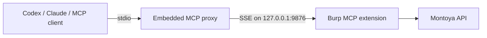

# Smart Burp MCP Server

## Overview

Connect Burp Suite to Codex CLI, Claude Desktop and other MCP clients. This fork extends PortSwigger's
MCP server with compact evidence indexes, native Burp IDs, Repeater/Intruder capture, Organizer workflows,
response comparison, diagnostics and reviewed single-request mutations.

For more information about the protocol visit: [modelcontextprotocol.io](https://modelcontextprotocol.io/)

## Features

- Native Codex CLI setup command using `java` from the terminal `PATH`
- Claude Desktop installer and embedded stdio-to-SSE proxy
- Compact Proxy, Site Map, Organizer, Repeater and Intruder indexes
- Native Burp IDs and content-derived Site Map keys for traceable evidence retrieval
- Bounded request/response chunks with credentials, cookies and tokens intact by default
- Color, regex, scope, static-resource, host, method, status and MIME filters
- Repeater and Intruder capture after extension load, with bounded in-memory buffers
- Read-only response comparison and JSON-key/header difference analysis
- Reviewed single-request mutations protected by preview SHA-256 and target approval
- MCP runtime diagnostics, initialize instructions and metadata-only action audit log
- Theme-aware Burp UI, including restrained alternating rows in dark and light themes

## Usage

- Install the extension in Burp Suite
- Configure your Burp MCP server in the extension settings
- Configure your MCP client to use the Burp SSE MCP server or stdio proxy
- Interact with Burp through your client!

## Installation

### Prerequisites

Ensure that the following prerequisites are met before building and installing the extension:

1. **Java**: Java must be installed and available in your system's PATH. You can verify this by running `java --version` in your terminal.
2. **Build dependencies**: The first Gradle build needs access to the Gradle distribution and Maven repositories. Packaging embeds the proxy JAR through Gradle and does not require an external `jar` command.

### Building the Extension

1. **Clone the Repository**: Obtain the source code for the MCP Server Extension.
   ```
   git clone https://github.com/thezakman/smart-mcp-server.git
   ```

2. **Navigate to the Project Directory**: Move into the project's root directory.
   ```
   cd smart-mcp-server
   ```

3. **Build the JAR File**: Use Gradle to build the extension.
   ```
   ./gradlew embedProxyJar
   ```

   This command compiles the source code and packages it into `build/libs/burp-mcp-all.jar`.
   Run `./gradlew test embedProxyJar` to run the regression suite as well.

### Loading the Extension into Burp Suite

1. **Open Burp Suite**: Launch your Burp Suite application.
2. **Access the Extensions Tab**: Navigate to the `Extensions` tab.
3. **Add the Extension**:
    - Click on `Add`.
    - Set `Extension Type` to `Java`.
    - Click `Select file ...` and choose the JAR file built in the previous step.
    - Click `Next` to load the extension.

Upon successful loading, the MCP Server Extension will be active within Burp Suite.

## Configuration

### Configuring the Extension
Configuration for the extension is done through the Burp Suite UI in the `MCP` tab.
- **Toggle the MCP Server**: The `Enabled` checkbox controls whether the MCP server is active.
- **Enable config editing**: The `Enable tools that can edit your config` checkbox allows the MCP server to expose tools which can edit Burp configuration files.
- **Advanced options**: You can configure the port and host for the MCP server. By default, it listens on `http://127.0.0.1:9876`.

### Claude Desktop Client

To fully utilize the MCP Server Extension with Claude, you need to configure your Claude client settings appropriately.
The extension has an installer which will automatically configure the client settings for you.

1. Currently, Claude Desktop only support STDIO MCP Servers
   for the service it needs.
   This approach isn't ideal for desktop apps like Burp, so instead, Claude will start a proxy server that points to the
   Burp instance,  
   which hosts a web server at a known port (`localhost:9876`).

2. **Configure Claude to use the Burp MCP server**  
   You can do this in one of two ways:

    - **Option 1: Run the installer from the extension**
      This will add the Burp MCP server to the Claude Desktop config.

    - **Option 2: Manually edit the config file**  
      Open the file located at `~/Library/Application Support/Claude/claude_desktop_config.json`,
      and replace or update it with the following:
      ```json
      {
        "mcpServers": {
          "burp": {
            "command": "<path to Java executable packaged with Burp>",
            "args": [
                "-jar",
                "/path/to/mcp/proxy/jar/mcp-proxy-all.jar",
                "--sse-url",
                "<your Burp MCP server URL configured in the extension>"
            ]
          }
        }
      }
      ```

3. **Restart Claude Desktop** - assuming Burp is running with the extension loaded.

## Manual installations
If you want to install the MCP server manually you can either use the extension's SSE server directly or the packaged
Stdio proxy server.

### Codex CLI

In the Burp **MCP → Installation** panel, click **Copy Codex CLI command**. Paste the copied command
into your terminal (zsh/bash on macOS/Linux, PowerShell on Windows) and press Enter.
The button extracts the packaged stdio proxy and copies a single-line `codex mcp add burp -- ...`
command using `java` from PATH, the proxy path and configured server address. Arguments are quoted
for the target shell; copying does not execute Codex or change its configuration.

Run the command in a terminal where `codex` works. Java 21 or newer must be on Codex's PATH.
Codex handles TOML parsing and adds or replaces the
`burp` entry while preserving unrelated configuration. `CODEX_HOME`, if set, comes from your terminal.
If you change the server host or port, copy and run the command again.

For manual setup, extract the proxy JAR from the installation panel and run:

```sh
codex mcp add burp -- java -jar "/absolute/path/to/mcp-proxy.jar" --sse-url http://127.0.0.1:9876
codex mcp get burp
codex mcp list
```

Restart the Codex session and use `/mcp` to inspect the connection. This extension serves **SSE**;
Codex's `--url` option is for **Streamable HTTP**, so use the packaged stdio proxy here.

References: [manual setup PR #83](https://github.com/PortSwigger/mcp-server/pull/83),
[installer proposal #85](https://github.com/PortSwigger/mcp-server/pull/85), and
[official Codex MCP documentation](https://developers.openai.com/codex/mcp/).

## How it connects



The extension serves MCP over SSE. Clients that only support stdio launch the packaged proxy JAR, which
connects to the local SSE endpoint. Target requests still pass through Burp's configured request-approval flow.

## MCP tool catalog

### Requests, Burp tabs and utilities

| Tool | Purpose |
| --- | --- |
| `send_http1_request` | Send one explicit HTTP/1.1 request after target approval |
| `send_http2_request` | Send one explicit HTTP/2 request after target approval |
| `create_repeater_tab` / `create_repeater_tab_http2` | Create a Repeater tab from supplied content without sending it |
| `create_repeater_tab_from_history` | Open the exact captured Proxy request in Repeater by native Burp ID |
| `send_to_intruder` | Create an Intruder tab from supplied content without starting an attack |
| `send_history_item_to_intruder` | Open an exact captured Proxy request in Intruder by native Burp ID |
| `replay_history_item` | Replay one captured request unchanged, with target approval |
| `url_encode` / `url_decode` | Encode or decode URL data |
| `base64_encode` / `base64_decode` | Encode or decode Base64 data |
| `generate_random_string` | Generate a random value with a selected alphabet |

### Burp state, configuration and Professional tools

| Tool | Purpose |
| --- | --- |
| `output_project_options` / `output_user_options` | Export Burp configuration as JSON |
| `set_project_options` / `set_user_options` | Merge configuration when config editing is enabled |
| `set_task_execution_engine_state` | Pause or resume Burp's task execution engine |
| `set_proxy_intercept_state` | Enable or disable Proxy Intercept |
| `get_active_editor_contents` / `set_active_editor_contents` | Read or update the focused editable message editor |
| `get_scanner_issues` | Read Scanner findings in Burp Professional |
| `generate_collaborator_payload` / `get_collaborator_interactions` | Generate and poll Collaborator payloads in Burp Professional |

### Captured traffic and evidence triage

The additional read-only workflow is inspired by
[geozin/burp-mcp-colorstrike](https://github.com/geozin/burp-mcp-colorstrike).
Organizer, Site Map and capture workflows also incorporate reviewed ideas from
[r3verii/mcp-server](https://github.com/r3verii/mcp-server/blob/main/CUSTOMIZATIONS.md).

| Tool | Purpose | Defaults |
| --- | --- | --- |
| `get_proxy_http_history_summary` | Native ID, color, method, endpoint without query values, status, parameter names and response-start timing | Highlighted traffic; static assets omitted; 20 items |
| `get_requests_by_color` | Request, response and notes for selected colors | 5 items; 5,000 characters per message; credentials intact; compaction enabled |
| `get_request_by_index` | Retrieve an exchange by the native Burp `#` ID, including uncolored or static items | 10,000 characters per message; original content |
| `get_proxy_http_history_regex` | Search URL, request, response and notes with optional color/scope filters | All colors and scopes; credentials intact |
| `get_proxy_websocket_history` | Bounded WebSocket history with native message/connection IDs | Project scope; credentials intact; 20 items |
| `get_proxy_websocket_history_regex` | Search WebSocket endpoint, payload and notes | Project scope; credentials intact; 20 items |
| `get_web_socket_message_by_index` | Retrieve a complete WebSocket payload in bounded chunks by native ID | Original content; credentials and encoded data intact |
| `create_repeater_tab_from_history` | Open the exact captured request in Repeater by native ID | Does not send the request |
| `send_history_item_to_intruder` | Open the exact captured request in Intruder by native ID | Does not start an attack |
| `replay_history_item` | Replay one captured request unchanged with the existing per-target approval | One request; no injection, batching or retries |
| `list_site_map` | Compact Site Map inventory with filters and content-derived keys | 50 entries; no bodies |
| `get_site_map_items_by_key` | Retrieve selected Site Map exchanges by key | Original content in bounded chunks |
| `list_organizer_items` / `get_organizer_items_by_id` | Compact Organizer index followed by selected details | Native Organizer IDs |
| `save_exchange_to_organizer` | Save an existing Proxy/Repeater/Intruder exchange | No target traffic |
| `get_repeater_traffic` / `get_intruder_traffic` | Index traffic observed after extension load | In-memory buffers; 1,000 per tool |
| `get_captured_exchange_by_id` | Retrieve a captured Repeater/Intruder exchange | Original content in bounded chunks |
| `compare_http_exchanges` | Compare two captured responses | No target traffic |
| `preview_request_mutation` | Render one explicit request mutation for review | No target traffic |
| `send_mutated_request` | Send the exact reviewed mutation once | Preview hash and target approval required |
| `get_mcp_diagnostics` | Show endpoint, runtime, embedded proxy and buffer status | No target traffic |
| `get_mcp_action_log` | Show bounded local tool audit events | Never stores arguments or bodies |

Legacy bulk tools remain available for compatibility: `get_proxy_http_history`, `get_organizer_items` and
`get_organizer_items_regex`. Prefer the compact index and detail tools above because they avoid loading unrelated
request and response bodies into the MCP context.

Examples of MCP tool arguments:

```json
{"colors":["RED","GRAY"],"count":10,"offset":0}
```

Use that with the summary tool. For a detail page:

```json
{"colors":["RED"],"count":2,"offset":0,"maxMessageChars":5000}
```

For one captured exchange:

```json
{"index":105,"contentOffset":0,"maxMessageChars":10000}
```

Build a filtered Site Map index and fetch selected evidence:

```json
{"host":"api.example.test","method":"POST","inScopeOnly":true,"count":50,"offset":0}
```

Pass the returned `key` to `get_site_map_items_by_key`:

```json
{"keys":["<site-map-sha256>"],"contentOffset":0,"maxMessageChars":10000}
```

Compare two captured Proxy responses without sending anything:

```json
{"leftSource":"PROXY","leftId":105,"rightSource":"PROXY","rightId":112}
```

Preview a single mutation:

```json
{"sourceId":105,"location":"HEADER","name":"X-Debug","value":"1","maxMessageChars":20000}
```

Only after reviewing the exact request, pass the returned `mutatedSha256` to `send_mutated_request` together
with the same mutation fields. A mismatch fails closed before target approval or transmission.

IDs are Burp's persistent IDs, not positions in a filtered list. Results are newest first. `offset` applies
to filtered history items; page responses include `total`, `returned`, `colorCounts` and `nextOffset`.
`colorCounts` describes all matching items. Pagination reflects the current history snapshot; concurrent
removals can still shift offsets. The first history page also returns `snapshotMaxId`; reuse it on later pages
to exclude newly arriving traffic, and retain native IDs when tracking individual exchanges.
Summary pages allow 1–100 items and detail pages 1–20. Color names are case-insensitive and include
`GRAY` and `NONE`. To include uncolored traffic in the summary, set `highlightedOnly=false`.
To include assets such as JavaScript or images, set `includeStatic=true`.

Detail messages are individually bounded to 256–50,000 characters. Each includes `originalCharacters`,
`availableCharacters`, `offset`, `nextOffset`, `truncated` and `transformed`. Follow a message's
`nextOffset` using `get_request_by_index` with the same masking/compaction settings to retrieve its next
chunk. JSON is always serialized after text transformation; truncation never slices the JSON document
or a Unicode surrogate pair. Credentials remain intact by default. `redactSecrets=true` enables optional
best-effort masking; `compact=false` disables visual-noise compaction and returns original text in bounded
chunks. The captured traffic itself is never changed.

Optional masking covers common credential headers, complete Cookie/Set-Cookie values (no secret prefixes),
Bearer/JWT tokens and common JSON/form credential fields. It is best-effort and **does not guarantee
removal of all credentials or personal data**, especially custom fields and URL path segments.
Compaction replaces SVG, form ViewState and long encoded-looking values, and is independently optional.
Timing is observed response-start latency, nullable when unavailable; it does not establish a vulnerability.
All history tools honor Burp's existing data-access controls. Read tools send no target traffic;
the Repeater/Intruder helpers only create local tabs and preserve the captured request object.

ColorStrike's automatic batching and attack prompt are not included. Explicit mutations use a two-step flow:
`preview_request_mutation` returns the exact request plus `mutatedSha256`; `send_mutated_request` accepts that
hash and refuses to send if its reconstructed request differs. It performs one request with no retry.
The build also adopts portable proxy packaging, implemented with Gradle's archive inputs instead of ZIP
rewriting. `build`, `shadowJar` and the compatible `embedProxyJar` entry point all include the proxy resource.

### Permissions and data handling

- Project-data reads use Burp's HTTP history, WebSocket history and Organizer approval controls.
- Target-bound sends use the existing per-host approval and auto-approved target list.
- Read-only tools do not generate target traffic. Creating a Repeater or Intruder tab also does not send it.
- Captured authentication material is returned unchanged by default. `redactSecrets=true` is available only on
  tools that explicitly expose that option.
- The action log stores tool name, timestamp, duration and error text. It does not store arguments or results.
- Repeater and Intruder buffers are memory-only, hold at most 1,000 exchanges per tool and are cleared when the
  MCP server or extension stops.

### Current limitations

- Montoya cannot read Repeater tabs or Intruder attacks that occurred before this extension registered its HTTP handler.
- Site Map entries do not expose a native Montoya ID, so `list_site_map` returns a SHA-256 lookup key derived from
  the request and service.
- `offset` can shift when entries are removed. Proxy triage pages return `snapshotMaxId` to exclude newer arrivals;
  retain native IDs for evidence references.
- Explicit mutation supports one request at a time. There is no automatic payload batch or retry loop.

### Verification

Run `./gradlew test embedProxyJar` with Java 21 available. The new regression checks cover native IDs,
filtering, bounded regex work, pagination, valid JSON, Unicode chunking, optional redaction, WebSocket
scope filtering, native Repeater/Intruder handoff, missing responses, timings, defaults and access denial.
To check the installed Codex CLI's configuration behavior independently, run
`python3 scripts/check-codex-cli.py` (Python 3.11+). It uses a temporary Codex configuration and does not
change your real configuration or start the configured server.

Implementation and current validation limits are recorded in [implementation notes](docs/implementation-notes.md).

### SSE MCP Server
To use the SSE server directly, provide the configured server URL to your MCP client:
```
http://127.0.0.1:9876
```

### Stdio MCP Proxy Server
The source code for the proxy server can be found here: [MCP Proxy Server](https://github.com/PortSwigger/mcp-proxy)

In order to support MCP Clients which only support Stdio MCP Servers, the extension comes packaged with a proxy server for
passing requests to the SSE MCP server extension.

If you want to use the Stdio proxy server you can use the extension's installer option to extract the proxy server jar.
Once you have the jar you can add the following command and args to your client configuration:
```
/path/to/packaged/burp/java -jar /path/to/proxy/jar/mcp-proxy-all.jar --sse-url http://127.0.0.1:9876
```

If you modify the proxy source, rebuild and copy it into this project before packaging the extension:
```bash
# From mcp-proxy
./gradlew shadowJar
cp build/libs/mcp-proxy-all.jar /path/to/mcp-server/libs/mcp-proxy-all.jar

# From mcp-server
./gradlew embedProxyJar
```

### Creating / modifying tools

Tools are defined in `src/main/kotlin/net/portswigger/mcp/tools/Tools.kt`. To define new tools, create a new serializable
data class with the required parameters which will come from the LLM.

The tool name is auto-derived from its parameters data class. A description is also needed for the LLM. You can return
a string or a `List<ContentBlock>` to provide data back to the LLM.

Extend the Paginated interface to add auto-pagination support.
